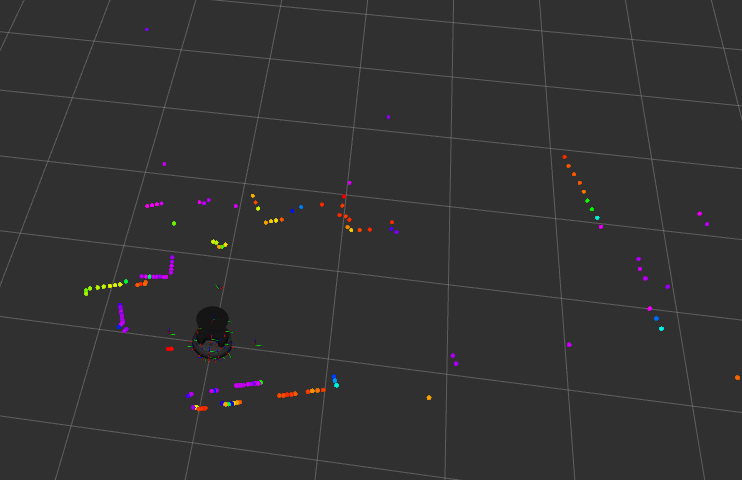

# Turtlebot4_lds02_bringup

TurtleBot4 (Humble) 의 vendor RPLIDAR-A1 를 ROBOTIS **LDS-02 (LD08)** 로 교체하기 위한 bringup shim. **vendor 패키지를 수정하지 않고** systemd drop-in / launch shim / udev 룰 세 레이어로 LiDAR 노드만 swap-in 한다.

> **Scope**: 본 repo 는 **TurtleBot4 RPi4 (Humble) 위에서 빌드 / 배포되는 특수 목적 shim**. **LiDAR 영역만 swap** 하며, OAK-D 카메라 / wheel odometry / IMU / battery 등 다른 sensor stack 은 vendor `turtlebot4-bringup` service 가 그대로 처리한다. 따라서 launch shim 도 vendor `standard.launch.py` 의 LiDAR 호출만 대체하고 `oakd.launch.py` 등 나머지 호출은 vendor 가 별도 경로로 처리하므로 본 shim 에서는 다루지 않는다.

## 구성

```
src/turtlebot4_lds02_bringup/
├── launch/
│   └── turtlebot4_bringup.launch.py   # vendor standard.launch.py 미러 + ld08_driver 삽입
├── systemd/
│   └── override.conf                   # turtlebot4.service drop-in
└── udev/
    └── 99-lds02.rules                  # CP2102 USB-serial 권한 룰
```

자체 ROS 노드 없음 — vendor `ld08_driver` (apt: `ros-humble-ld08-driver`) 를 그대로 사용.

---

## 클린 설치 (TurtleBot4 RPi4)

> **설치 경로 고정**: 워크스페이스는 `~ubuntu/Turtlebot4_lds02_bringup_ws` 로만 설치한다. systemd drop-in 의 `ExecStart=` 가 해당 절대 경로를 참조하므로 다른 위치는 미지원 (단일 robot / 단일 사용자 가정).

### 사전 조건

- **인터넷 연결**: TurtleBot4 RPi4 가 외부 인터넷에 접근 가능해야 한다. `sudo apt install ros-humble-ld08-driver` (Ubuntu 저장소) 와 `git clone https://github.com/...` (GitHub) 두 단계가 외부 접근에 의존. WiFi / 이더넷 어느 쪽이든 OK — `ping 8.8.8.8` 또는 `sudo apt update` 로 확인.
- TurtleBot4 RPi4 의 **standard 이미지** 위에서 작업한다.
  - `systemctl is-active turtlebot4.service` → `active` (vendor service 가 정상 운영 상태)
  - `/etc/turtlebot4/setup.bash` 존재 (vendor 환경 source)
  - vendor 패키지: `ros-humble-turtlebot4-bringup` 1.0.3+, `ros-humble-turtlebot4-description` 1.0.5+
- **물리 작업**: RPLIDAR-A1 분리 후 동일 sensor mount plate 에 LDS-02 (LD08) 부착. USB 는 vendor 와 동일 포트 (`/dev/ttyUSB0`) 로 연결.
- **단일 LiDAR 가정**: 본 shim 은 RPLIDAR-A1 + LDS-02 동시 연결 시나리오를 지원하지 않는다 (CP2102 동종 USB descriptor). RPLIDAR 는 반드시 물리 분리.

### 단계 1 — PC dry-run (선택 사항)

실기 적용 전 PC 에서 build / executable / launch import 단계 통과 확인.

```bash
git clone https://github.com/Seooooooogi/Turtlebot4_lds02_bringup.git
cd Turtlebot4_lds02_bringup
colcon build --symlink-install
source install/setup.bash

ros2 pkg executables ld08_driver | grep ld08_driver        # ld08_driver 출력 포함 확인
ros2 launch turtlebot4_lds02_bringup turtlebot4_bringup.launch.py    # vendor 미설치 PC 에서는 PackageNotFoundError 가 정상 동작
```

PC 에서 `ld08_driver` 검증을 하려면 `sudo apt install ros-humble-ld08-driver` 가 필요할 수 있다.

### 단계 2 — TurtleBot4 RPi4 에 적용

RPi4 에 ssh 후 ubuntu 사용자로 실행:

```bash
# 1. vendor 드라이버
sudo apt install ros-humble-ld08-driver

# 2. workspace clone (경로 고정)
git clone https://github.com/Seooooooogi/Turtlebot4_lds02_bringup.git ~/Turtlebot4_lds02_bringup_ws
cd ~/Turtlebot4_lds02_bringup_ws
colcon build --symlink-install

# 3. udev 룰 (CP2102 → /dev/ttyUSB0 0666)
sudo install -m 0644 src/turtlebot4_lds02_bringup/udev/99-lds02.rules /etc/udev/rules.d/99-lds02.rules
sudo udevadm control --reload-rules
sudo udevadm trigger

# 4. systemd drop-in
sudo install -d /etc/systemd/system/turtlebot4.service.d
sudo install -m 0644 src/turtlebot4_lds02_bringup/systemd/override.conf /etc/systemd/system/turtlebot4.service.d/override.conf
sudo systemctl daemon-reload
sudo systemctl restart turtlebot4.service
```

### 단계 3 — 자동기동 확인 (재부팅 검증)

```bash
sudo reboot
# 부팅 후 ssh 재접속
systemctl status turtlebot4.service        # active, Drop-In: .../override.conf
journalctl -u turtlebot4.service -n 50     # ld08_driver 기동 라인 확인
```

---

## 검증

부팅 직후 systemd 가 active 가 되어도 `ld08_driver` 의 디바이스 init + 첫 ROS publish 까지 **추가 ~15 초** 가 필요하다. 검증 명령은 그 후 실행.

```bash
# Hz (~10 Hz)
ros2 topic hz /<ROBOT_NAMESPACE>/scan

# 메시지 내용 (frame_id == rplidar_link, ranges/intensities 정상)
ros2 topic echo /<ROBOT_NAMESPACE>/scan sensor_msgs/msg/LaserScan --once

# TF (vendor URDF 좌표)
ros2 run tf2_ros tf2_echo base_link rplidar_link \
  --ros-args -r __ns:=/<ROBOT_NAMESPACE> -r /tf:=tf -r /tf_static:=tf_static
```

**Notes**:

- TurtleBot4 vendor 환경은 **FastDDS Discovery Server 모드**로 동작한다. 일반 client 의 `ros2 topic list` 는 `/parameter_events`, `/rosout` 만 보일 수 있다. 토픽 데이터 자체는 위 `echo --type --once` / `hz` 명령으로 정상 수신된다.
- TF 는 `<ROBOT_NAMESPACE>` 안 (`/<ns>/tf`, `/<ns>/tf_static`) 으로 publish 되므로 위와 같이 `__ns` + `/tf` remap 이 필요하다.

### 시각 검증 (RViz, PC)

PC 에서 vendor mesh 패키지 설치 후 본 패키지의 RViz config 로 실행:

```bash
sudo apt install ros-humble-turtlebot4-description    # 첫 PC setup 시 1회
source install/setup.bash

ros2 run rviz2 rviz2 \
  -d $(ros2 pkg prefix turtlebot4_lds02_bringup)/share/turtlebot4_lds02_bringup/rviz/lds02_check.rviz \
  --ros-args -r /tf:=/<ROBOT_NAMESPACE>/tf -r /tf_static:=/<ROBOT_NAMESPACE>/tf_static
```

정상 동작 시 화면 — TurtleBot4 mesh + `rplidar_link` 좌표축 + `/<ROBOT_NAMESPACE>/scan` 점 분포 (intensity 컬러맵):



화면에 산발 점 (cool tone) 이 보이는 것은 LDS-02 raw 측정 특성 (저반사율 표면 / 광택 / single-shot raw) 으로, 통합 결함이 아니다. SLAM 의 scan matching 이 자연 흡수한다.

---

## 롤백

LDS-02 통합을 제거하고 vendor RPLIDAR-A1 운용으로 되돌리려면:

```bash
# systemd drop-in 제거
sudo rm /etc/systemd/system/turtlebot4.service.d/override.conf
sudo systemctl daemon-reload
sudo systemctl restart turtlebot4.service

# (선택) udev 룰 제거
sudo rm /etc/udev/rules.d/99-lds02.rules
sudo udevadm control --reload-rules
```

vendor 본체 (`/lib/systemd/system/turtlebot4.service`) 는 본 shim 이 수정하지 않으므로 drop-in 만 제거하면 즉시 vendor 동작으로 복귀. 물리적으로는 LDS-02 분리 + RPLIDAR-A1 재장착.

---

## 의존성

- ROS 2 Humble
- `ros-humble-ld08-driver` 1.1.4+
- `ros-humble-turtlebot4-bringup` 1.0.3+
- `ros-humble-turtlebot4-description` 1.0.5+
- `ros-humble-turtlebot4-diagnostics` (선택, `TURTLEBOT4_DIAGNOSTICS=1` 시)
- `ros-humble-nav2-common` (RewrittenYaml 용)

---

## 부록 — RPLIDAR-A1M8 vs LDS-02 (LD08) 스펙 비교

본 통합은 vendor 의 RPLIDAR-A1 자리에 LDS-02 를 drop-in 한다. 두 보드의 핵심 차이는 다음과 같다 (출처: SLAMTEC RPLIDAR-A1 datasheet, ROBOTIS LDS-02 datasheet — 보드 리비전에 따라 미세 차이 가능).

| 항목 | **RPLIDAR-A1M8** (SLAMTEC) | **LDS-02 / LD08** (ROBOTIS) | 비고 |
|---|---|---|---|
| FOV | 360° | 360° | 동일 |
| Range | 0.15 – 12 m | 0.16 – 8.0 m | LDS-02 가 max range 짧음 → 큰 실내 / 넓은 환경에서 차이 발생 |
| Scan frequency | 5.5 Hz typical (1 – 10 Hz adj.) | 5 – 10 Hz (default 8 Hz) | 본 통합 측정 ~10.5 Hz (LDS-02 상한 부근) |
| Sample rate | ~8000 samples/sec | ~1800 samples/sec | A1 이 4× dense, 동일 각도에서 더 많은 점 |
| Angular resolution | ~1° (rate 의존) | ~1° | 본 통합 측정 ~1.65° (218 pts/scan) |
| Distance accuracy | ~1% of measured distance | ±15 mm (close-range), ±5% of distance (far) | A1 이 거리 무관 일관 정확도, LDS 는 근거리에 강점 |
| Wavelength | 785 nm | 905 nm (Class 1 eye-safe) | LDS-02 가 인체 안전 등급 더 명시적 |
| Interface | USB serial (CP2102) | USB serial (CP2102) | **동일 칩** — 단일 LiDAR 가정의 근거 (Hard Rule #7) |
| Power | 5 V DC (USB 전원) | 5 V DC (USB 전원) | 동일 |
| Weight | ~170 g | ~125 g | LDS-02 가 가벼움 |

**운영상 함의**:

- max range 차이 (12 m → 8 m) 로 SLAM `max_laser_range` / Nav2 `obstacle_max_range` 등 RPLIDAR 스펙에 의존한 파라미터는 재튜닝 후보.
- sample rate 차이 (8000 → 1800 sps) 는 정밀 매핑 / Nav2 obstacle 검출 해상도에 영향. 본 통합 검증 환경 (실내 소공간) 에서는 무관.
- 본 통합의 회귀 테스트는 vendor 환경 (URDF / Nav2 / SLAM 기본 파라미터) 그대로에서 동작 가능 여부에 한정한다. 스펙 차이로 인한 결과 차이는 "통합 결함" 이 아니라 "LiDAR 특성 차이" 로 분리 평가.

---

## 라이선스

Apache 2.0
